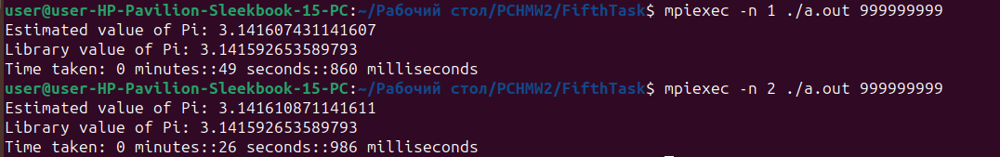

### Отчет по пятой лабораторной работе:

В качестве программы, рещающую вычислительную задачу, которая может быть разбита на параллельные задачи  и обменивается данными между потоками был реалиован метод Монте-Карло для вычисления приблизительного числа Pi. Для распараллеливания этой задачи и обмена информацией между потоками была использованна директивы MPI. 
#### Запуск
* компиляция : mpic++ main.cpp
* запуск : mpiexe -n 1 ./a.out 999999999
 где 1 - кол-во потоков, 999999999 - количество точек для подсчета числа Pi.

#### результат работы программы

При увеличении числа потоков наблдается явное улучшие производительности, из чего можно сделать вывод то программа работает правильно.