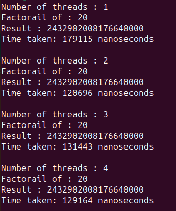

### Результат работы программы:

Явного улучшения производительности не наблюдается, поскольку программа выполняет всего 20 операций умножения, что для современных компьютеров не занимает много времени.
