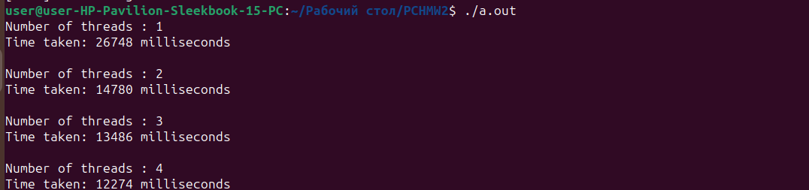

### Отчет по четвертой лабораторной работе:

В качестве программы, рещающую вычислительную задачу, которая может быть разбита на параллельные задачи была реализованна функция умножения матриц. Для распараллеливания этой задачи была использованна директивы OpenMP. В качестве данных использовались случайно сгенерированные матрица размером 500х500.

#### результат работы программы

При увеличении числа потоков наблдается явное улучшие производительности, из чего можно сделать вывод то программа работает правильно.