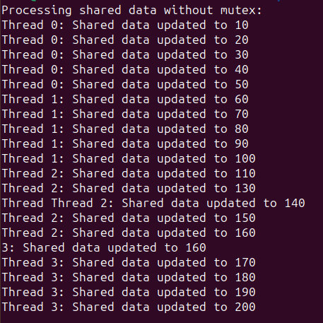
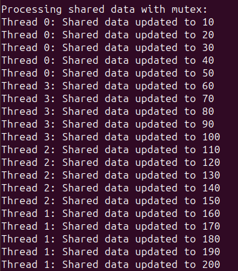

### Отчет по второй лабораторной работе:
Для изучения работы мьютексов была смоделированна ситуация, в которой потоки параллельно изменяют общий ресурс, а именно некоторое целочисленное значение. Для наглядности совершенные изменения отображаются в консоли. 
#### результат без мьютекса:

Как можно наблюдать, некоторые процессы по изменеию общей даты совершаются одновременно, что может повлечь за собой непредсказуемое поведение.

#### результат с использование мьютекса:

При использовании мьютекса гонки процессов не возникает, общий ресурс обновляется постепенно каждым процессом по порядку.
