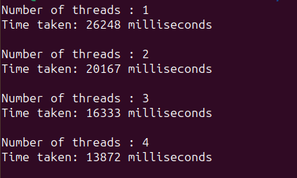

### Отчет по третьей лабораторной работе:

В качестве программы, рещающую вычислительную задачу, которая может быть разбита на параллельные задачи была реализована сортировка пузырьком. Для распараллеливания этой задачи была использованна директивы OpenMP. В качестве данных использовался массив нулей размером 80000 элементов. Наполнение массива не важно, поскольку сортировка все равно имеет сложность O(n^2). Программа была протестирована для разного кол-ва потоков.

#### результат работы программы

При увеличении числа потоков наблдается явное улучшие производительности, из чего можно сделать вывод то программа работает правильно.